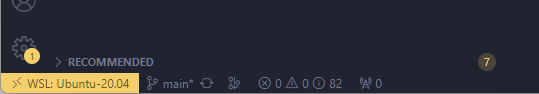

# Webbutveckling 2 - Javascript intro

Repetition av grunderna i programmering med javascript. Kopplat till vad du bör kunna efter kursen Programmering 1.

Du kommer även få en introduktion till diverse byggverktyg och miljöer som du kommer att använda i kursen.


## Installation

Du behöver installera [Windows Subsystem Linux](https://learn.microsoft.com/en-us/windows/wsl/about) (WSL). Detta för att köra programmen `nvm`, `node` och `npm`.

 - [nvm](https://github.com/nvm-sh/nvm), node version manager, hanterar vilken version av node du kör.
 - [nodejs](https://nodejs.org/en) är en webbserver.
 - [npm](https://www.npmjs.com/) är en pakethanterare för node.

1. Se till att du har kört Windows updates, kör dem sedan igen.
2. Följ instruktionerna på [jensa.dev](https://jensa.dev/posts/webbserver-programmering/) om hur du installerar WSL och nvm.

**Bra** nu bör du kunna öppna en terminal med Ubuntu.

Se till att du följt instruktionerna för att skapa en code mapp.

```bash
cd
mkdir code
cd code
ls -la
```

### VSCode och forka

3. Kör igång Visual Studio Code.
4. Installera extension, `ctrl+shift+X`, WSL från Microsoft.
5. Koppla upp dig mot WSL genom att klicka nere i vänstra hörnet.



6. Forka detta repo, [wu2-js](https://github.com/jensadev/wu2-js) och klona ner det till din dator. För att göra detta använd Git i VScode. Tryck `ctrl+shift+P` och skriv `git clone` och följ instruktionerna.
7. Se till att du öppnar mappen `wu2-js` i VSCode.

## Vite

Det verktyg du kommer att använda i den här uppgiften heter [Vite] (https://vitejs.dev/). Vite kan hjälpa dig att bygga ett antal olika varianter av Javascript-ramverk och annat.

För att köra Vite behöver du npm och du kommer att köra detta under WSL, därav installationsinstruktionerna.

När du forkar detta repo så har det redan skapats ett Vite-projekt. Om du önskar göra detta eller behöver göra det i ett annat sammanhang så är kommandot.

```bash
npm create vite@latest
```

Följ sedan instruktionerna, du kan läsa mer på [Vite, Getting Started](https://vitejs.dev/guide/).


### Deploy

På det här repot så är även GitHub-actions aktiverat, så att när du pushar till `main` så byggs projektet `npm run build` och hostar resultatet på GitHub-pages.

Av den anledningen så ska du även får lära dig om branches och pull requests. Du kommer arbeta i lektions branches och göra pull requests till main när du är klar.

 - Skapa ny bran för lektionen
 - Gör dina ändringar
    - Pusha upp till GitHub
    - Gör en pull request till main
    - Vänta på att den blir godkänd
    - Merga in den i main
    - Gå tillbaka till main
    - Pulla ner ändringarna
    - Städa upp lokalt
    - Gå tillbaka till steg 1

## Kom igång

Innan du kan köra igång Vite så behöver du installera en del paket som krävs för att köra Vite. Detta gör du genom att köra kommandot `npm install`. Du kör det från mappen `wu2-js`, du kan kontrollera att du är i rätt mapp genom att köra kommandot `pwd`.

```bash
cd wu2-js
pwd
npm install
```

Vite är nu installerat och du kan köra igång en webbserver för test genom att köra kommandot `npm run dev`.

```bash
npm run dev
```

# Uppgifter

Följande är områden från Programmering 1 som du kommer att repetera. Vissa delar är sådan som du arbetat med i kursen Webbutveckling 1.

## Mål

Att du ska ha en bättre förståelse för grundläggande programmering och hur du kan använda JavaScript för att skapa interaktiva webbsidor.

### Variabler och Datatyper

Förstå hur du deklarerar variabler med var, let och const. Känn till de olika datatyperna som används i JavaScript, inklusive number, string, boolean, null, undefined, object och array.

### Operatorer

Kunna använda aritmetiska operatorer (+, -, *, /), jämförelseoperatorer (==, ===, !=, !==, >, <, >=, <=) och logiska operatorer (&&, ||, !) för att utföra olika operationer i JavaScript.

### Kontrollstrukturer

Förstå hur du använder if-satser och loopar som for och while för att skapa villkorliga och upprepade operationer.

### Array och Objekt

Kunna hantera listor och objekt i JavaScript, inklusive att lägga till, ta bort och modifiera element.

### Funktioner

Kunna definiera och använda funktioner med function-nyckelordet. Förstå konceptet med parametrar och returvärden i funktioner.

### Scope och Closures

Förstå koncepten om omfattning (scope) och avslutningar (closures) för att undvika problem med variabelkonflikter och förstå hur JavaScript-hanterar funktioners omfattning.

### Händelser (events) och hur de hanteras

Veta hur du kopplar händelser som klick, muspekare och tangenttryckningar till JavaScript-funktioner för att göra webbsidor interaktiva.


## Andra områden som kommer

Detta är sådan som du kommer att få öva och arbeta med under kursens gång.

### DOM-manipulation

Förstå Document Object Model (DOM) och hur man kan använda JavaScript för att ändra och manipulera HTML-element på en webbsida.


### Asynkron programmering

Grundläggande kunskap om asynkrona operationer, användningen av setTimeout, setInterval, och Promise för att hantera icke-blockerande operationer.

### Felsökning

Förmåga att använda webbläsarens inbyggda utvecklingsverktyg eller andra verktyg som VS Code för att felsöka JavaScript-kod.


### JavaScript, språket

Grunderna i att skapa objekt och använda konstruktorfunktioner eller klasser för att organisera din kod enligt OOP-principer.

Bekanta dig med moderna JavaScript-funktioner som arrow-funktioner, template strings, och destructuring.